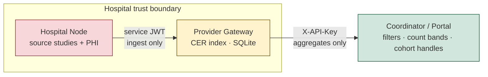
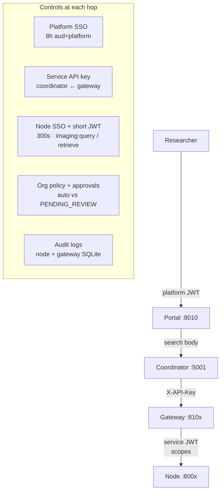
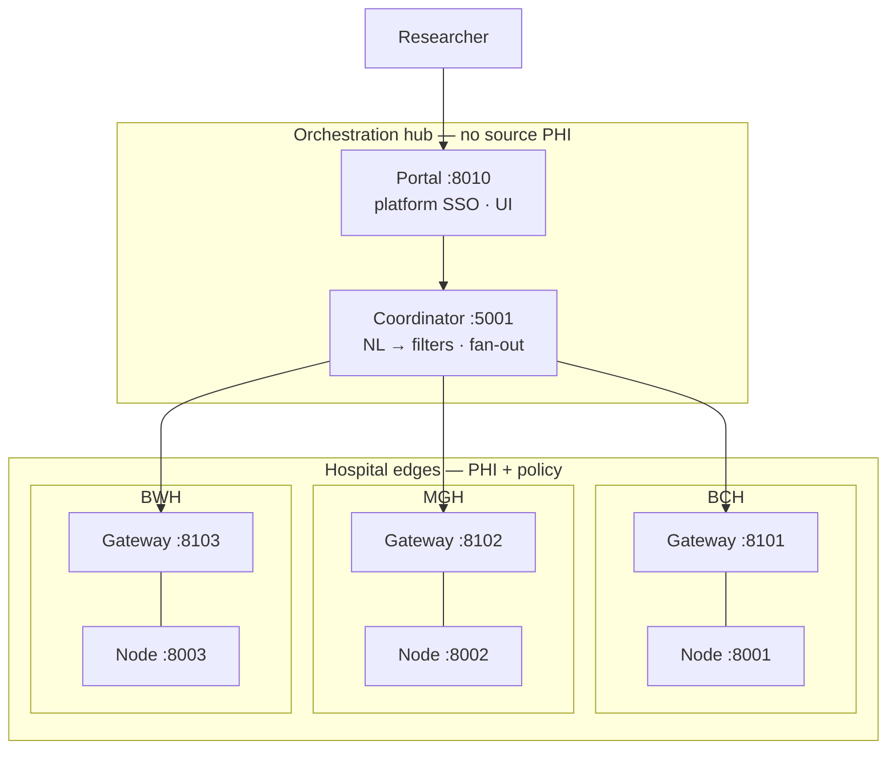
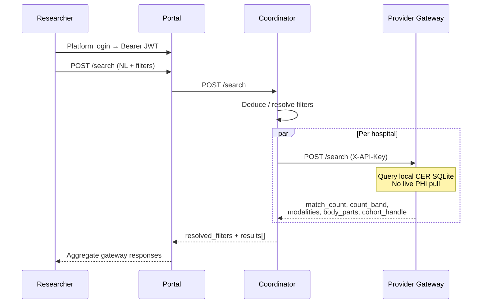
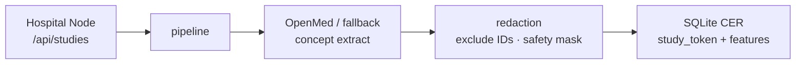

# Federated DICOM Search

Hospital-controlled imaging discovery for research. Researchers search across sites from one portal; **source PHI stays at the hospital**. What leaves the edge is de-identified Clinical Evidence Records (CERs), count bands, and opaque study tokens — not patient names, MRNs, or DICOM UIDs.

Hackathon Track 1: zero-trust hospital edges + a thin orchestration hub.

See **Honest limits** below for known gaps to own in a pitch.

---

## Why this is a good solution

Centralizing raw imaging metadata in a shared warehouse creates one honeypot, one BAA blast radius, and one policy for every site. This stack does the opposite: **federation with a privacy enforcement point (PEP) at each hospital**.


| Problem with central PHI               | What we do instead                                                                |
| -------------------------------------- | --------------------------------------------------------------------------------- |
| One breach exposes every site          | PHI lives on hospital nodes; hub never stores source records                      |
| One policy for all hospitals           | Per-node SSO allowlists + per-gateway org approval policies                       |
| Exact counts leak rare patients        | Node k-anonymity suppress (`k=5`) + gateway count bands (`<10`, `10–24`, …)       |
| Researchers pull DICOM identifiers     | Opaque `study_token`; PatientName / PatientID / StudyUID excluded at ingest       |
| Hub must be the HIPAA system of record | Portal/coordinator see filters + aggregates; hospitals approve row-level previews |


Precedents: [SHRINE/ENACT](https://www.act-network.org/) (federated counts), TriNetX (commercial analog), SMART/OAuth scopes, [NIST SP 800-207](https://csrc.nist.gov/publications/detail/sp/800-207/final) (PEP at the edge).

### PHI never centralizes




- **Source PHI** stays in `data/hospitals/*.json` on the hospital node (Compose bind-mounts it read-only).
- **Ingest redaction** (`provider_gateway/redaction.py`) drops `PatientName`, `PatientID`, `PatientBirthDate`, `StudyID`, `StudyInstanceUID`, `Diagnosis`, `InstitutionName`.
- Free-text diagnosis is run through concept extraction, then **discarded** — the CER keeps coded concepts + safe structured fields (age bucket, sex, year, modality, body part).
- Regex **safety mask** strips residual UID / email / phone / MRN / name patterns.
- Public search returns **match counts and count bands**, not study rows. Row previews require hospital org approval and an allowlisted field set.


### Security is layered, not bolted on




| Layer            | Mechanism                                                                                   |
| ---------------- | ------------------------------------------------------------------------------------------- |
| **Platform SSO** | Portal JWT unlocks UI/API (`platform_auth.py`)                                              |
| **Hospital SSO** | Per-node `.edu` allowlists; scopes `imaging:query` / `imaging:retrieve` (IRB + node policy) |
| **Service auth** | Shared `SERVICE_API_KEY` on coordinator → gateway                                           |
| **Query tiers**  | `full_metadata` vs `count_only` vs deny — by node policy                                    |
| **Approvals**    | Cohort freeze → access request → org policy → approved preview or human review              |
| **Audit**        | Node login/query/retrieve decisions; gateway ingest/cohort/access/dataset events            |


Dual SSO is intentional: unlocking the product is not the same as being authorized at a hospital edge.

### Lightweight by design

Same zero-trust shape as a production PEP — without K8s, a shared warehouse, or a message bus.


| Choice                                          | Why it matters                                                                                         |
| ----------------------------------------------- | ------------------------------------------------------------------------------------------------------ |
| **Docker Compose + one multi-stage Dockerfile** | Full three-hospital demo on a laptop                                                                   |
| **SQLite gateway indexes**                      | No Postgres/Redis to operate for the demo                                                              |
| **JSON hospital “PACS”**                        | Committed study files; edit data without rebuilds                                                      |
| **Optional heavy deps**                         | `OPENMED_FORCE_FALLBACK=1` skips model download; empty `GEMINI_API_KEY` still runs on explicit filters |
| **Frozen contracts**                            | `shared/contracts.py` — small, explicit DTOs across services                                           |
| **Two run modes**                               | Minimal: BCH only · Full: `--profile portal` (MGH/BWH + coordinator + portal)                          |


---


## Architecture




| Service          | Port      | Role                                                             |
| ---------------- | --------- | ---------------------------------------------------------------- |
| Portal           | 8010      | Platform SSO + product/lab UI; brokers search to coordinator     |
| Coordinator      | 5001      | NL filter deduction (Gemini) + gateway fan-out only              |
| Provider gateway | 8101–8103 | Hospital privacy boundary: CER index, search, cohorts, approvals |
| BCH / MGH / BWH  | 8001–8003 | Local study store, node SSO, query tiers, audit                  |


**Trust rule:** the coordinator and portal talk to **gateways**, never raw hospital nodes, for federated search.

### Federated search flow




### Ingest → CER (PHI stays local)




---


## Quick start


### Docker Compose (recommended)

```bash
cp .env.example .env                          # set TOKEN_SECRET + SERVICE_API_KEY
docker compose up --build                     # BCH node :8001 + gateway :8101
docker compose --profile portal up --build    # + MGH/BWH, coordinator :5001, portal :8010
```

- Portal UI: [http://127.0.0.1:8010](http://127.0.0.1:8010)
- Lab / test UI: [http://127.0.0.1:8010/lab](http://127.0.0.1:8010/lab)
- Without Docker: `./tools/run_local_demo.sh` (BCH node + gateway)


### Local scripts (nodes + portal)

```bash
python3 -m venv venv
source venv/bin/activate
pip install -r requirements.txt
export PYTHONPATH="$PWD"

./scripts/start_nodes.sh      # Terminal 1 — :8001–8003
./scripts/start_portal.sh     # Terminal 2 — :8010
```

Contract smoke: `python3 tests/contract_smoke.py`

---


## Portal API


| Method | Path              | Description                                      |
| ------ | ----------------- | ------------------------------------------------ |
| POST   | `/platform/login` | Platform SSO → session token                     |
| GET    | `/platform/me`    | Current platform session                         |
| POST   | `/search`         | Platform Bearer; coordinator fan-out to gateways |
| POST   | `/retrieve`       | Broker study payload (platform Bearer → node)    |
| GET    | `/profiles`       | Demo researcher presets                          |
| GET    | `/audit/{node}`   | Proxy node audit log                             |


---


## Layout

```
services/
  hospital-node/       # Hospital edge: SSO, /query, /retrieve, /audit
  portal/portal/       # Researcher portal (platform SSO + UI)
  provider-gateway/    # Installable gateway: redaction, CER, cohorts, approvals
coordinator/           # Flask: Gemini filters + gateway fan-out (:5001)
shared/                # Frozen cross-service contracts + vocab
data/
  hospitals/           # bch/mgh/bwh_data.json (committed)
  gateway/             # gateway SQLite state (generated)
  reports/             # accuracy/benchmark output (generated)
scripts/               # start_nodes.sh, start_portal.sh
tests/                 # pytest, contract smoke, eval/benchmark
tools/                 # run_local_demo.sh, dev_explorer.py
compose.yml
Dockerfile             # multi-stage: hospital-node · gateway · portal · coordinator
```

Run from the repo root (`PYTHONPATH` includes `shared`). Launcher scripts and images set this for you.

## Gateway environment


| Variable                           | Notes                                                |
| ---------------------------------- | ---------------------------------------------------- |
| `PROVIDER_CODE` / `PROVIDER_NAME`  | e.g. `BCH` / `Boston Children's Hospital`            |
| `NODE_URL`                         | This provider’s hospital node                        |
| `DATABASE_PATH`                    | SQLite CER index path                                |
| `TOKEN_SECRET` / `SERVICE_API_KEY` | Study-token secret / coordinator shared key          |
| `OPENMED_FORCE_FALLBACK`           | `1` = keyword concepts only; skips model download    |
| `NODE_SERVICE_*`                   | Identity the gateway uses when the node enforces SSO |


Hospital study JSON lives under `data/hospitals/`; Compose bind-mounts it read-only (`HOSPITAL_DATA_DIR` overrides the location).


